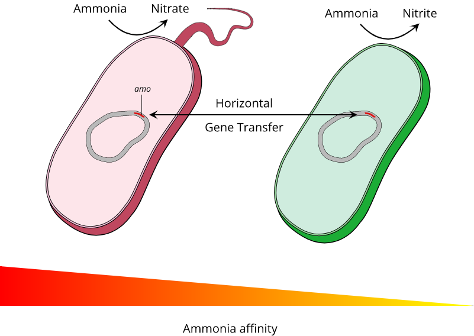

# Title

> Note: this is just a skeleton for the term paper in markdown. Feel free to keep or discard any part of this structure.

## Heading

### Subheading 1

### Subheading 2

*Figure 1: Example Caption*

### Subheading 3

## References

 1. [Reference 1](http://www.refrencewebsite.come)
 1. [Reference 2](http://www.refrencewebsite.come)
 1. [Reference 3](http://www.refrencewebsite.come)
